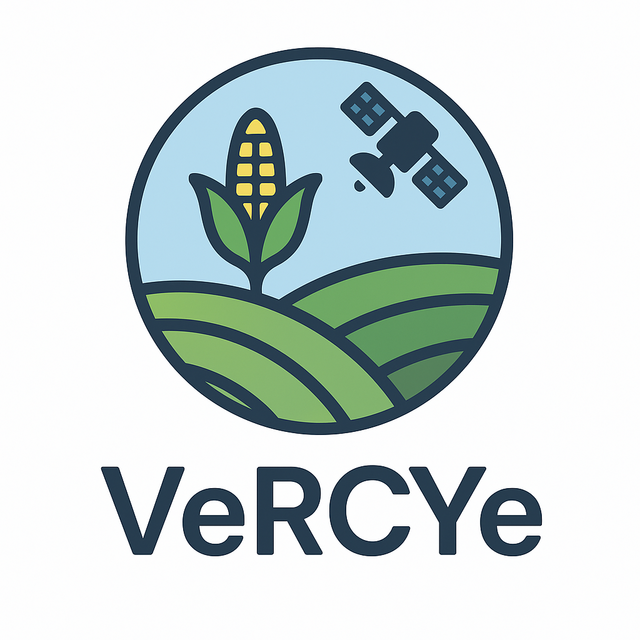

# VeRCYe Ops

  

  <b>Code to support operations of the Versatile Crop Yield Estimate (VeRCYe) pipeline.</b>  
  The original VeRCYe algorithm is <a href="https://doi.org/10.1007/s13593-024-00974-4">published here</a>.

  
  
  

## ✨ Features

- Reduces manual effort required for executing the VeRCYe crop yield estimate pipeline.
- All workflow steps exposed via a documented CLI for step-by-step execution.
- Includes a Snakemake-based pipeline for batch processing and reproducibility.
- Automatic computation of validation metrics
- Utilities to download meteorological data, Sentinel-2 Imagery and to generate LAI products

## 🚀 Quick Start
Follow the setup instructions in the  **[Documentation](https://jplmlia.github.io/vercye_ops/)** and refer to the [Running VeRCYe section](https://jplmlia.github.io/vercye_ops/Vercye/running.md) to setup and run your first yield study.

## 📚 Documentation
Make sure to check out the documentation here: **[https://jplmlia.github.io/vercye_ops/](https://jplmlia.github.io/vercye_ops/)**.

## 📄 License
See the [LICENCE](LICENSE)

## © Copyright Notice
"Copyright 2024, by the California Institute of Technology. ALL RIGHTS RESERVED. United States Government Sponsorship acknowledged. Any commercial use must be negotiated with the Office of Technology Transfer at the California Institute of Technology.
