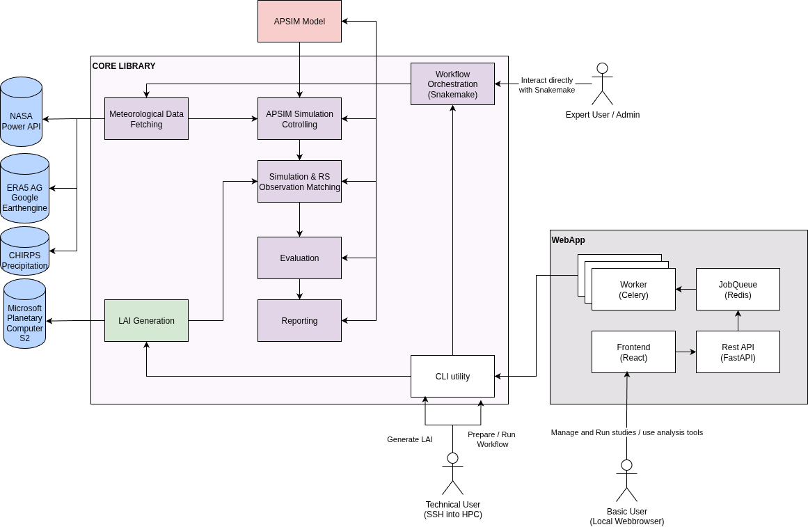

# VeRCYe Documentation

This documentation aims to provide a comprehensive guide to running the Versatile Crop Yield Estimate (VeRCYe) pipeline. The original VeRCYe algorithm is [published here](https://doi.org/10.1007/s13593-024-00974-4).

### Overview

The **VeRCYe Repository** contains a number of components:

- **The VerCYe Library**: Contains all steps to run the VeRCYe algorithm as individual python scripts. The scripts are orchestrated into a pipeline using `Snakemake`. In general the library is split into two components:
    - **LAI Generation**: Downloads remotely sensed imagery and predicst Leaf Area Index (LAI) values per pixel.
    - **Yield Simulation and Prediction**: Simulate numerous likely configurations using APSIM and identify the best-matching simulations with the LAI data. This step also includes evaluation and reporting tools.
- **The VeRCYe Webapp**: Provides a webapp wrapper around the core library. Runs a backend and a frontend service that facilitate using VeRCYe operationally.

---

### VeRCYe Library Setup

#### 0. Clone this repository

```bash
git clone https://github.com/JPLMLIA/vercye_ops.git
cd vercye_ops
```

#### 1. Install the requirements

VeRCYe is distributed as a Python package with a [conda-managed](https://docs.conda.io/projects/conda/en/stable/user-guide/install/index.html) runtime.

**Conda (recommended)** - Conda is the only fully supported installation method. It bundles GDAL, Snakemake, Earth Engine, and all other native dependencies into a single self-contained environment. A `requirements.txt` is provided for reference, but pip-only installs are **not** supported - GDAL and other system-level libraries are difficult to install correctly through pip alone.

```bash
# Production environment
conda env create -f environment/environment.yaml
conda activate vercye
```

For development (includes linting, testing, and type-checking tools):

```bash
# Development environment
conda env create -f environment/environment.dev.yaml
conda activate vercye-dev
```

#### 2. Install the VeRCYe package

From the root directory, run:

```bash
pip install -e .
```

#### 3. Install APSIMX

VeRCYe depends on process-based APSIM NextGen model for yield & phenology(LAI) simulation. Two modes are supported:
- Docker-based APSIM
- Local APSIM binary

See the the [APSIM Section](Vercye/apsim.md) for details.


#### 4. Authenticate Google Earth Engine
The ERA5 meteorological data is currently still fetched through Google Earth Engine. You have two options:

**Option A — Service account (recommended for headless/server setups):**

Place your GCP service account JSON key on the machine and set `EE_SERVICE_ACCOUNT_KEY=/path/to/key.json` in your `.env`. The service account must be registered with Earth Engine and have the `roles/serviceusage.serviceUsageConsumer` and `roles/earthengine.viewer` roles on the project. See [Meteorological Data](Vercye/metdata.md#era5) for details.

**Option B — Interactive login:**

On a machine with a browser, run:
```bash
earthengine authenticate
```

### Running your first yield study

**Quickstart**

The `VeRCYe CLI` allows you to get your yield study up an running quickly. However, if you want more options to customize different hyperparameters in a more structured way, you might want to run the study manually, as outlined in the next section.

0. Activate your virtual environment (depending on your venv setup). E.g:

```bash
conda activate vercye
```

1. Initialize a new yield study.

```bash
vercye init --name your-study-name --dir /path/to/study/store
```

2. [Optional] Download remotely sensed imagery & create LAI.

- Only required if the LAI data for your region of interest is not yet available locally.
- Fill in the lai configuration under `/path/to/study/store/lai_config.yaml`.
- Run the following command to download the imagery:
```bash
vercye lai --name your-study-name --dir /path/to/study/store
```

3. Prepare your study

- Fill in the run congfiguration under `/path/to/study/store/setup_config.yaml`.
- Run the following command to create your study directory and config template.
```bash
vercye prep --name your-study-name --dir /path/to/study/store
```
4. Set your run options

- Fill in the run congfiguration under `/path/to/study/store/study/config.yaml`.
- If you already had the LAI data available locally, ensure to adapt the `lai_dir`, `lai_region` and `lai_resolution`.


5. [Optional] Download the chirps data.

- Only required if chirps data is not yet downloaded for the complete study range.
- Ensure you have completed step 4, and have set `apsim_params.chirps_dir` correctly in `/path/to/study/store/study/config.yaml`.

```bash
vercye chirps --name your-study-name --dir /path/to/study/store
```

6. Run your study

- You might want to adapt the number of cores to use in /path/to/study/store depending on your system.

```bash
vercye run --name your-study-name --dir /path/to/study/store/profile/config.yaml
```


**Running VeRCYe manually**

While the CLI provides a convenient way to run a yield study, for larger experiments with different configurations, you might want more freedom. For this the general process is as follows:

1. You will first have to generate **LAI** data from remotely sensed imagery. Refer to the [LAI Creation Guide](LAI/running.md) for details.

2. Once you have generated the **LAI** data, you can run your yield study, by following the [Running a Yieldstudy Guide](Vercye/running.md).

### VeRCYe Webapp Setup

On information for setting up and running the webapp, visit the [Webapp Section](Vercye/webapp.md).

### Technical Details



- **Library Details**: The technical implementation details of the vercye library are outlined in the [VeRCYe Architecture Section](Vercye/architecture.md). Fore more details check out the code in `vercye_ops`.
- **Webapp Details**: The details on architectural decisions of the webapp are documented under [VeRCYe Webapp](Vercye/webapp.md).


### Development
Development tips and best practices are documented under [Development Tipps](devtipps.md)
